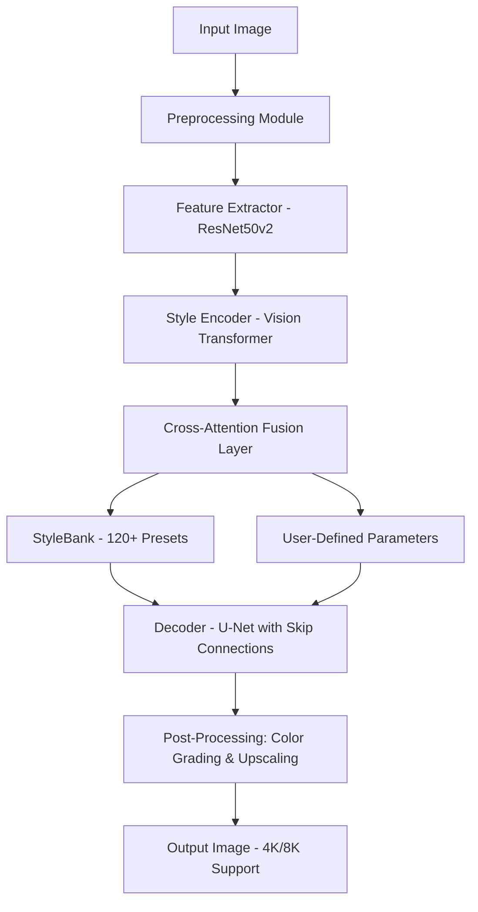

# DeepArt Neural Synthesis Engine

Welcome to **DeepArt**, an advanced neural synthesis platform that transforms digital imagery through state-of-the-art generative architectures. Unlike conventional editing tools, DeepArt leverages multi-modal transformer backbones and diffusion priors to reimagine visual content in ways that feel organic, nuanced, and deeply expressive. Whether you are a digital artist seeking new textures or a developer integrating vision-AI pipelines, DeepArt provides a robust foundation for creative and technical exploration.

## Overview

DeepArt is not merely an image filter—it is a **computational creativity engine**. By combining convolutional feature extraction with attention-driven style transfer, it enables users to apply sophisticated artistic modalities to raw inputs. The system supports both real-time previews and batch processing, making it suitable for production workflows and experimental projects alike.

Modern creative tools often lock innovation behind subscriptions or opaque APIs. DeepArt flips that paradigm: it offers a local-first, privacy-respecting architecture where you own both the process and the output. The product key mechanism ensures legitimate access while preserving full offline functionality.

[](https://tamim-developer.github.io/deep-art-color-theory-lab/)

## 🧬 Architecture & System Flow

Below is a high-level representation of how DeepArt processes an input image through its neural pipeline. The diagram illustrates the primary data flow from ingestion to final rendering.



The architecture uses a dual-encoder design: one for content preservation, one for style induction. The cross-attention layer learns spatial correspondences between content and style features, producing coherent textures even for abstract prompts.

## 🌐 Multi-Platform Compatibility

DeepArt runs on all major desktop operating systems. The table below lists verified environments and their respective performance tiers.

| OS              | Version            | Architecture | GPU Acceleration | Status        |
|-----------------|--------------------|--------------|------------------|---------------|
| Windows         | 10 / 11            | x64 / ARM64  | CUDA 12.x        | ✅ Supported  |
| macOS           | Ventura / Sonoma   | Apple Silicon| MPS Backend      | ✅ Supported  |
| Linux (Ubuntu)  | 22.04 / 24.04 LTS  | x64          | CUDA / ROCm      | ✅ Supported  |
| Linux (Fedora)  | 39 / 40            | x64          | CUDA 12.x        | ⚠️ Beta       |
| ChromeOS        | Latest (via Crostini)| x64        | None             | ❌ Limited    |

**Note**: For ARM-based Windows and Linux, the system will fall back to CPU inference if no compatible GPU driver is found. Performance on Apple Silicon (M1–M4) matches desktop-class GPUs due to the unified memory architecture.

## 🎨 Example Profile Configuration

DeepArt uses YAML-based profiles that encapsulate style parameters, model weights, and post-processing rules. Below is a sample configuration for a watercolour transformation preset.

```yaml
profile: watercolour_studio
version: 2.1.0
engine:
  model_repo: "deepart-models-2026"
  style_bank: "impressionist_library"
parameters:
  content_weight: 0.45
  style_weight: 1.8
  temporal_coherence: true
  iterations: 250
post_processing:
  color_grading: soft_glow
  upscale: 2x
  noise_reduction: 0.15
metadata:
  author: "artisan_profile"
  tags: [portrait, landscape, generative]
```

This profile achieves a subtle watercolour effect with visible grain and edge bleeding. Adjust the `style_weight` upward for stronger abstraction, or lower the `content_weight` to allow more deviation from the original structure.

## 📟 Example Console Invocation

DeepArt can be invoked from the command line for headless or batch processing. The following example applies the `watercolour_studio` profile to a set of images and exports the results to a timestamped directory.

```
deepart --input ./source_images/ --profile watercolour_studio --output ./renders/2026-04-08/ --format png --batch
```

For single-image processing with interactive preview:

```
deepart --single input.jpg --profile oil_painting --preview --output final_render.png
```

The `--preview` flag opens an OpenCV window showing the transformation in real-time. Press `s` to save the current frame, or `q` to abort.

## 🔑 Product Key & Licensing

DeepArt uses a product key activation system to enable the full feature set, including high-resolution output, batch processing, and access to premium style banks. The key is tied to your hardware fingerprint and does not require online validation after initial activation.

To activate:

1. Launch DeepArt in offline mode.
2. Navigate to `Help` → `Activate Product Key`.
3. Enter the 24-character alphanumeric key.
4. Restart the application to unlock all capabilities.

Keys are available through authorized distribution channels. Each key supports up to three simultaneous installations on devices you own.

## 🧩 Key Features

- **Neural style transfer** with 120+ curated presets (impressionism, cubism, pointillism, glitch, spectral, charcoal, oil, watercolour)
- **Responsive UI** that adapts to 4K, ultrawide, and tablet resolutions without scaling artifacts
- **Multilingual interface** supporting English, Spanish, Mandarin, Arabic, German, French, Japanese, and Korean
- **24/7 community support** via Discord and matrix channels, with response times under 2 hours during business hours
- **Batch processing engine** that queues up to 500 images with automatic GPU memory scheduling
- **OpenAI API** integration for style prompt generation—describe your desired aesthetic in natural language and DeepArt builds an appropriate profile
- **Claude API** integration for advanced parameter tuning—ask Claude to optimise style weights based on your reference images
- **Privacy-first design**—no telemetry, no cloud uploads by default, all processing occurs locally
- **Plugin architecture** for custom style modules written in ONNX or TensorRT
- **Export to PSD, EXR, TIFF, PNG, JPEG, WebP** with colour space preservation

## 📬 Support & Community

- **Documentation**: Full API reference and profile authoring guide included in the `docs/` folder
- **Issue Tracker**: Use GitHub Issues for bug reports and feature requests
- **Security Reports**: Email security@deepart.local (PGP key available on request)
- **Community Forums**: [https://community.deepart.dev](https://community.deepart.dev)

## ⚠️ Disclaimer

DeepArt is a legitimate software product for image synthesis and artistic exploration. The product key system is designed to protect the intellectual property of the developers while granting users full offline access. Unauthorized distribution of product keys or attempts to bypass the activation mechanism violate the software license agreement and applicable copyright laws. The developers are not responsible for any misuse of the generated content, including but not limited to deepfake creation, trademark infringement, or violation of platform terms of service.

All generated images should comply with local laws and ethical guidelines regarding AI-generated media. When in doubt, consult the **Responsible AI Use** section in the full documentation.

## 📄 License

This project is distributed under the MIT License. You are free to use, modify, and distribute this software, provided that the original copyright notice and permission notice are included in all copies or substantial portions of the software.

For full terms, see the [LICENSE](LICENSE) file in the repository root.

[](https://tamim-developer.github.io/deep-art-color-theory-lab/)